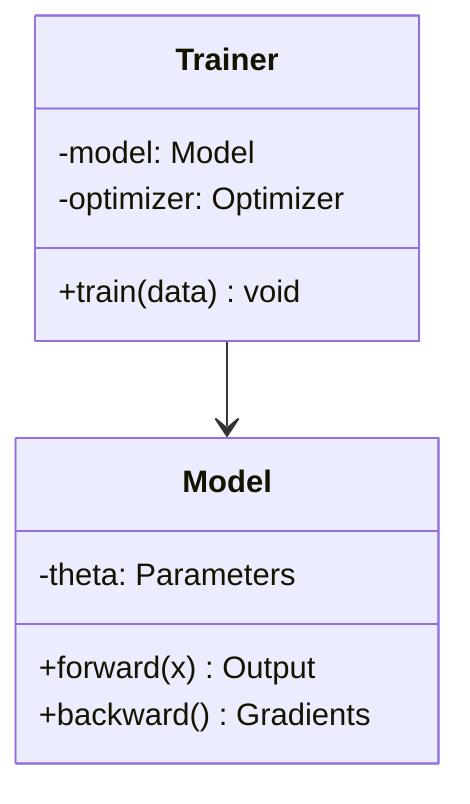
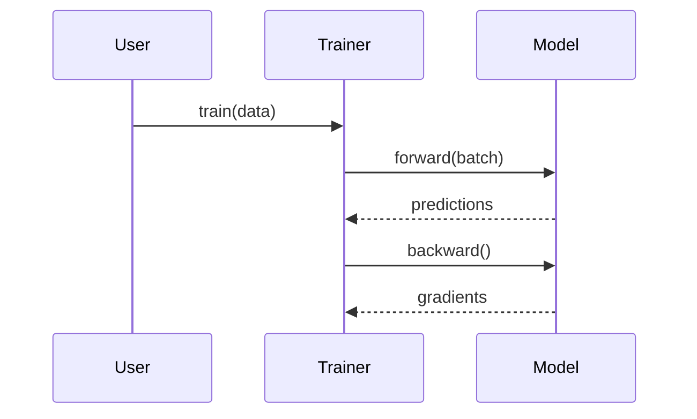

# Advanced Phase (09)

Specialized capabilities: survey papers, paper-to-code, and algorithm design.

## Skills Consolidated

- **survey-generation**: Complete survey paper generation with multi-LLM outline and RAG writing
- **paper-to-code**: Convert research papers to runnable code repositories
- **algorithm-design**: Design algorithms with LaTeX pseudocode and Mermaid UML diagrams

## Survey Paper Generation

### AutoSurvey Pipeline

**Six-phase process**:

### Phase 1: Paper Collection
- Search multiple sources (Semantic Scholar, arXiv, OpenAlex)
- Filter by relevance and citation count
- Target: 50-200 papers for comprehensive survey

### Phase 2: Multi-LLM Outline Generation
- Generate 5-10 outline variants in parallel
- Select best outline (most comprehensive, logical flow)
- Refine selected outline

### Phase 3: RAG-Based Subsection Writing
For each subsection:
1. Retrieve most relevant papers from collection
2. Generate content with inline citations `[paper_title]`
3. Ensure coverage of key works

### Phase 4: Citation Validation
1. Check all citations exist in paper collection
2. Verify citations support claims made
3. Remove or correct unsupported citations

### Phase 5: Local Coherence Enhancement
1. Check transitions between paragraphs
2. Improve flow without changing content
3. Preserve all citations

### Phase 6: Convert Citations to BibTeX
1. Extract all cited papers
2. Generate BibTeX entries
3. Validate all keys in .bib file

### Output Structure
```
survey_paper/
├── survey.tex           # Main LaTeX file
├── references.bib       # All citations
├── outline.md           # Final outline used
├── paper_collection.jsonl  # All collected papers
└── figures/             # Taxonomy diagrams, trend plots
```

### Survey Quality Checklist

- [ ] Comprehensive coverage of field
- [ ] Clear taxonomy/categorization
- [ ] Historical context provided
- [ ] Open challenges identified
- [ ] Future directions suggested
- [ ] All citations validated
- [ ] Logical flow between sections

## Paper-to-Code Pipeline

### Three-Stage Process

### Stage 1: Planning
1. Read paper thoroughly
2. Identify key algorithms/methods
3. Plan repository structure
4. List required dependencies

### Stage 2: Analysis
1. Extract algorithm pseudocode
2. Identify data formats
3. Note hyperparameters
4. Map evaluation metrics

### Stage 3: Coding
1. Implement core algorithm
2. Add data loading/preprocessing
3. Add evaluation code
4. Write tests and examples

### Output Structure
```
paper_implementation/
├── README.md            # Setup instructions, usage
├── requirements.txt     # Dependencies
├── src/
│   ├── __init__.py
│   ├── model.py         # Core algorithm
│   ├── data.py          # Data loading
│   └── eval.py          # Evaluation
├── experiments/
│   ├── config.yaml      # Hyperparameters
│   └── run.sh           # Experiment script
├── tests/
│   └── test_model.py
└── notebooks/
    └── example.ipynb
```

### Validation

- [ ] Code runs without errors
- [ ] Reproduces paper results (or close)
- [ ] Well-documented (docstrings, README)
- [ ] Tests pass
- [ ] Example notebook works

## Algorithm Design

### LaTeX Pseudocode

Use `algorithm2e` or `algorithmicx` package:

```latex
\usepackage[lined,boxed,linesnumbered]{algorithm2e}

\begin{algorithm}
\caption{My Algorithm}
\KwIn{Input description}
\KwOut{Output description}

Initialize $\theta \sim \mathcal{N}(0, I)$\;
\For{epoch $t = 1$ to $T$}{
    Sample mini-batch $\mathcal{B}$\;
    Compute loss $L = \frac{1}{|\mathcal{B}|}\sum_{(x,y)\in\mathcal{B}} \ell(f(x;\theta), y)$\;
    Update $\theta \leftarrow \theta - \eta \nabla_\theta L$\;
}
\KwRet{Trained parameters $\theta$}
\end{algorithm}
```

### Mermaid UML Diagrams

**Class Diagram**:


**Sequence Diagram**:


### Code-Pseudocode Consistency

Ensure algorithm in paper matches implementation:
- Same variable names (or clear mapping)
- Same loop structure
- Same mathematical operations
- Same input/output formats

## Scripts

| Script | Purpose | Key Flags |
|--------|---------|-----------|
| (survey generation uses external AutoSurvey pipeline) | | |
| (paper-to-code uses external prompts) | | |
| (algorithm design uses templates) | | |

## Reference Files

- **Survey prompts**: See original `survey-generation/references/survey-prompts.md`
- **Paper-to-code prompts**: See original `paper-to-code/references/paper-to-code-prompts.md`
- **Algorithm templates**: See original `algorithm-design/references/algorithm-templates.md`

## When to Use Advanced Phase

- **Survey generation**: Writing a survey/tutorial paper, not a standard research paper
- **Paper-to-code**: Implementing a method from a paper you found
- **Algorithm design**: Your paper has a novel algorithm that needs clear presentation

## Downstream

- **Survey generation**: Full paper output, ready for formatting (Phase 06)
- **Paper-to-code**: Runnable repository, can feed into experiments (Phase 03)
- **Algorithm design**: Pseudocode for Methods section (Phase 05)