# 🦀 Rust Mega Skill

> **Rust entry router** — start here, then dive into the references.
> Use it for triage and navigation; do not stop at the top-level tables when trade-offs matter.

---

## How To Use This Skill

This skill gives you **three layers of depth**:

| Layer | What | Where |
|-------|------|-------|
| 🎯 **Layer 1: Triage Router** | Error codes / symptoms → first questions + which ref to read | Tables below |
| 📖 **Layer 2: Reference Module** | Deep-dive into one topic (patterns, trade-offs, examples) | `references/` |
| 🏗️ **Layer 3: Domain Constraints** | Domain-specific rules that shape design decisions | `domains/` |

### Navigation Flow

```
Got a Rust problem?
    ↓
Check Layer 1 tables → find error code / pattern
    ↓
Use the row to narrow the problem, not to freeze the solution
    ↓
Read the linked reference module for trade-offs and edge cases
    ↓
If domain-specific constraints apply → read one OR MORE domain mini-skills
    ↓
Trace up/down between layers for root causes
```

### Precedence Rules (read this before using the tables)

1. **Layer 1 is triage, not final design.** It helps you classify the problem quickly.
2. **Layer 2 beats Layer 1** whenever trade-offs, lifetimes, async, public API design, or performance are involved.
3. **Layer 3 beats generic advice** when domain constraints disagree with the generic tables.
4. **Domains compose.** Many real systems are web + cloud-native, fintech + web, CLI + embedded, etc. Read every relevant domain mini-skill and let the stricter constraint win.
5. If a top-level row and a deep reference seem to disagree, assume the top-level row was a simplification and follow the deeper reference.

### Stop: High-Risk Traps

Before acting on a quick fix, check these if they apply:

- **Async shared state / mutexes** → [07-concurrency](references/07-concurrency.md#critical-stdsyncmutex-vs-tokiosyncmutex)
- **Async cancellation / `select!` / `timeout`** → [07-concurrency](references/07-concurrency.md#critical-async-cancellation-safety)
- **`Drop` / transactions / cleanup in async** → [13-lifecycle](references/13-lifecycle.md#️-critical-drop-in-async-context)
- **`unsafe` code** → [09-performance](references/09-performance.md#miri-essential-for-unsafe-code)
- **Large stack allocations / `Box::new([0; N])`** → [09-performance](references/09-performance.md#stack-vs-heap-the-hidden-allocation-trap)
- **Public traits / blanket impls** → [05-type-driven](references/05-type-driven.md#️-critical-blanket-impl-semver-hazard)

---

## Layer 1: Error Code → Reference Router

### Ownership & Lifetimes

| Error | Symptom | First Questions | 🔗 Reference |
|-------|---------|-----------------|--------------|
| `E0382` | Use of moved value | Does the caller still need ownership, or should this be a borrow / redesign? | [Ownership & Borrowing](references/01-ownership.md) |
| `E0507` | Cannot move out of borrow | Is the API asking for ownership when it only needs a reference? | [Ownership & Borrowing](references/01-ownership.md) |
| `E0506` | Cannot assign while borrowed | End borrow before mutation | [references/01-ownership](references/01-ownership.md) |
| `E0515` | Cannot return local reference | Is the returned value borrowing local data that must become owned instead? | [Ownership & Borrowing](references/01-ownership.md) |
| `E0597` | Borrowed value does not live long enough | Is the scope wrong, or is the ownership model wrong? | [Ownership & Borrowing](references/01-ownership.md) |
| `E0716` | Temporary value dropped | Bind to variable | [references/01-ownership](references/01-ownership.md) |
| `E0106` | Missing lifetime annotation | Is there a real shared lifetime, or should data become owned / lifetimes split? | [Ownership & Borrowing](references/01-ownership.md) |
| `E0502` | Cannot borrow as mutable while immutable | Can scopes be split, or is shared mutability the wrong design? | [Mutability](references/03-mutability.md) |
| `E0499` | Multiple simultaneous mutable borrows | Can the data be partitioned, or should the API shape change? | [Mutability](references/03-mutability.md) |
| `E0596` | Cannot borrow immutable as mutable | Add `mut` or redesign | [references/03-mutability](references/03-mutability.md) |
| `E0509` | Cannot move out of type with Drop | Is this field meant to be optional / replaced during cleanup? | [Resource Lifecycle](references/13-lifecycle.md) |

### Resources & Smart Pointers

| Pattern | Question | Triage Default | 🔗 Reference |
|---------|----------|--------|--------------|
| Single owner, heap | "Need a heap-allocated value" | `Box<T>` | [Resource Management](references/02-resource-mgmt.md) |
| Shared, single-thread | "Multiple owners on one thread" | `Rc<T>` | [Resource Management](references/02-resource-mgmt.md) |
| Shared, multi-thread | "Multiple owners across threads" | `Arc<T>` | [Resource Management](references/02-resource-mgmt.md) |
| Break cycles | "Rc/Arc leak" | `Weak<T>` for one direction | [Resource Management](references/02-resource-mgmt.md) |
| Interior mut, single | "Mutable from &self (single-thread)" | `RefCell<T>` / `Cell<T>` | [Mutability](references/03-mutability.md) |
| Interior mut, multi | "Mutable from &self (multi-thread)" | Start with `Mutex<T>` / `RwLock<T>`, then check concurrency + domain refs before committing | [Mutability](references/03-mutability.md) |
| Runtime borrow panic | "RefCell panic!" | `try_borrow()` or restructure | [Mutability](references/03-mutability.md) |

### Generics & Polymorphism

| Situation | Choose | Why | 🔗 Reference |
|-----------|--------|-----|--------------|
| Type known at compile time | Generics / `impl Trait` | Zero-cost, static dispatch | [references/04-zero-cost](references/04-zero-cost.md) |
| Heterogeneous collection | `Vec<Box<dyn Trait>>` | Runtime dispatch | [references/04-zero-cost](references/04-zero-cost.md) |
| Plugin architecture | `dyn Trait` | Unknown types at compile | [references/04-zero-cost](references/04-zero-cost.md) |
| Closed type set | `enum` | No indirection, exhaustive | [references/04-zero-cost](references/04-zero-cost.md) |
| Reduce compile times | `dyn Trait` | Less monomorphization | [references/04-zero-cost](references/04-zero-cost.md) |

### Error Handling

| Situation | Triage Default | 🔗 Reference |
|-----------|----------------|--------------|
| Expected failure (library / public API) | Prefer typed errors (`thiserror`) at the boundary | [Error Handling](references/06-error-handling.md) |
| Expected failure (application edge) | `anyhow` is ergonomic at executable boundaries | [Error Handling](references/06-error-handling.md) |
| Absence is normal | `Option<T>` | [references/06-error](references/06-error-handling.md) |
| Bug / invariant | `panic!` / `expect("reason")` | [references/06-error](references/06-error-handling.md) |
| Retry-able failure | Retry only if the operation is transient **and idempotent** | [Error Handling](references/06-error-handling.md) |
| Transient vs permanent | Categorize errors by recovery | [references/06-error](references/06-error-handling.md) |

### Concurrency

| Workload | Triage Default | 🔗 Reference |
|----------|----------|--------------|
| CPU-bound parallelism | `std::thread` or `rayon` | [references/07-concurrency](references/07-concurrency.md) |
| I/O-bound concurrency | `async/await` + `tokio` | [references/07-concurrency](references/07-concurrency.md) |
| Shared immutable data | `Arc<T>` | [references/07-concurrency](references/07-concurrency.md) |
| Shared mutable data | Start by asking whether ownership transfer / channels can remove the shared mutable state; if not, choose the smallest viable lock | [Concurrency & Async](references/07-concurrency.md) |
| Message passing | Channels (`mpsc`, `broadcast`, `oneshot`) | [references/07-concurrency](references/07-concurrency.md) |
| Graceful shutdown | `CancellationToken` or signal handling | [references/07-concurrency](references/07-concurrency.md) |

### Common Compiler Errors

| Error | Likely Cause | Action | 🔗 Reference |
|-------|-------------|--------|--------------|
| `E0277: Send/Sync not satisfied` | Non-Send type in async/spawn | Check whether the task really needs cross-thread execution before reaching for `Arc` | [Concurrency & Async](references/07-concurrency.md) |
| `E0277: trait bound not satisfied` | Missing `impl` or wrong bound | Re-check trait bounds and API intent before widening constraints | [Zero-Cost Abstractions](references/04-zero-cost.md) |
| `E0308: type mismatch` | Wrong generic parameter | Check generic signatures and newtype/domain boundaries | [Type-Driven Design](references/05-type-driven.md) |
| `E0599: method not found` | Trait not imported | `use` the trait, then verify the method belongs on this abstraction | [Zero-Cost Abstractions](references/04-zero-cost.md) |
| `E0038: trait not object-safe` | Non-object-safe trait for `dyn` | Re-decide between generics, enum, or `dyn Trait` | [Zero-Cost Abstractions](references/04-zero-cost.md) |
| `E0433: can't find crate` | Missing `Cargo.toml` entry | Add dependency / feature and verify crate choice | [Ecosystem & Crates](references/10-ecosystem.md) |
| `E0603: private item` | Item not public | Check visibility modifiers and intended API surface | [Type-Driven Design](references/05-type-driven.md) |

### Newtype & Type Safety

| Need | Pattern | 🔗 Reference |
|------|---------|--------------|
| Type-safe wrappers | Newtype `struct UserId(u64)` | [Type-Driven Design](references/05-type-driven.md) |
| Compile-time states | Type State pattern | [references/05-type-driven](references/05-type-driven.md) |
| Gradual construction | Builder pattern | [references/05-type-driven](references/05-type-driven.md) |
| Capability markers | Marker types / traits | [references/05-type-driven](references/05-type-driven.md) |
| Lifetime/variance markers | `PhantomData` | [references/05-type-driven](references/05-type-driven.md) |

---

## Layer 2: Reference Modules

Each reference is a self-contained deep-dive with patterns, trade-offs, examples, and anti-patterns.

| # | Module | Covers | Extracted From |
|---|--------|--------|----------------|
| 01 | [Ownership & Borrowing](references/01-ownership.md) | Move, borrow, lifetime elision, `Cow`, common errors, visualization | m01-ownership, m14-mental-model, rust-patterns |
| 02 | [Resource Management](references/02-resource-mgmt.md) | `Box`, `Rc`/`Arc`, `Weak`, `Cell`/`RefCell`, decision flowchart | m02-resource, rust-patterns |
| 03 | [Mutability](references/03-mutability.md) | Borrow rules, interior mutability, `Mutex`/`RwLock`/`Atomic`, decision guide | m03-mutability, m07-concurrency |
| 04 | [Zero-Cost Abstractions](references/04-zero-cost.md) | Generics vs `dyn`, `impl Trait`, object safety, dispatch comparison | m04-zero-cost, rust-best-practices |
| 05 | [Type-Driven Design](references/05-type-driven.md) | Newtype, type state, PhantomData, marker traits, sealed traits, builder | m05-type-driven, rust-patterns |
| 06 | [Error Handling](references/06-error-handling.md) | `Result`/`Option`, `thiserror`/`anyhow`, domain errors, retry, circuit breaker | m06-error-handling, m13-domain-error, rust-testing |
| 07 | [Concurrency & Async](references/07-concurrency.md) | Threads vs async, Tokio patterns, Send/Sync, channels, streams, graceful shutdown | m07-concurrency, rust-async-patterns |
| 08 | [Testing](references/08-testing.md) | Unit/integration/doc tests, TDD, `rstest`, `proptest`, `mockall`, criterion, coverage | rust-testing, rust-patterns, rust-best-practices |
| 09 | [Performance](references/09-performance.md) | Profiling, allocations, cache, SIMD, LTO, PGO, optimization priority | m10-performance, rust-skills |
| 10 | [Ecosystem & Crates](references/10-ecosystem.md) | Crate selection, Cargo features, FFI (pyo3, wasm, napi), workspace | m11-ecosystem, rust-engineer |
| 11 | [Anti-Patterns](references/11-anti-patterns.md) | Clone everywhere, unwrap abuse, fighting borrow checker, code smells | m15-anti-pattern, rust-patterns, rust-skills |
| 12 | [Domain Modeling](references/12-domain-modeling.md) | DDD: Entity, Value Object, Aggregate, Repository, invariants | m09-domain, m05-type-driven |
| 13 | [Resource Lifecycle](references/13-lifecycle.md) | RAII, `Drop`, `OnceLock`/`LazyLock`, pools, guards, cleanup patterns | m12-lifecycle, rust-async-patterns |
| 14 | [Mental Models](references/14-mental-models.md) | Ownership visualization, analogy table, coming-from-X guides, misconceptions | m14-mental-model, m01-ownership, m15-anti-pattern |

---

## Layer 3: Domain Mini-Skills

Domain-specific constraints influence all design decisions. Load every relevant domain mini-skill when working in a composite system.

**Examples:**
- API service with deployment constraints → **Web + Cloud-Native**
- Payment API → **Web + FinTech + Cloud-Native**
- Device-side command tool → **CLI + Embedded**

If domain rules conflict, let the stricter operational constraint win.

| Domain | Key Constraints | 🔗 File |
|--------|----------------|---------|
| 🌐 **Web** | Async by default, thread-safe state, request lifecycle | [domains/web.md](domains/web.md) |
| 🖥️ **CLI** | Errors to stderr, data to stdout, exit codes, config layering | [domains/cli.md](domains/cli.md) |
| 📟 **Embedded** | `no_std`, no heap, interrupt safety, peripheral ownership | [domains/embedded.md](domains/embedded.md) |
| 💰 **FinTech** | No `f64` for money, audit trails, precision, transaction boundaries | [domains/fintech.md](domains/fintech.md) |
| ☁️ **Cloud-Native** | 12-Factor, stateless, graceful shutdown, observability | [domains/cloud-native.md](domains/cloud-native.md) |
| 📡 **IoT** | Offline-first, power constraints, unreliable network, device security | [domains/iot.md](domains/iot.md) |
| 🤖 **ML/AI** | Zero-copy tensors, GPU utilization, ONNX portability, batch processing | [domains/ml.md](domains/ml.md) |

---

## Quick Decision Flowcharts

These are **compressed heuristics**. If a flowchart output touches async, public APIs, domain constraints, or performance-sensitive code, validate it in the linked reference before committing.

### Which Smart Pointer?

```
Need heap allocation?
├─ Yes → Single owner? → Box<T>
│         └─ Shared? → Multi-thread?
│                        ├─ Yes → Arc<T>
│                        └─ No → Rc<T>
└─ No → Stack allocation (default)

Have reference cycles?
├─ Yes → Use Weak for one direction
└─ No → Regular Rc/Arc

Need interior mutability?
├─ Yes → Thread-safe?
│         ├─ Yes → T: Copy? → Atomic* : Mutex<T>
│         └─ No → T: Copy? → Cell<T> : RefCell<T>
└─ No → &mut T
```

### Static vs Dynamic Dispatch

```
Type known at compile time?
├─ Yes → Need heterogeneous collection?
│         ├─ Yes → Vec<Box<dyn Trait>> or enum
│         └─ No → Generics (impl Trait)
└─ No → dyn Trait

Priority: performance or binary size?
├─ Performance → Generics (monomorphization)
└─ Binary size → dyn Trait (shared code)
```

### Error Strategy

```
Is failure expected in normal operation?
├─ Yes → Is absence the only "failure"?
│         ├─ Yes → Option<T>
│         └─ No → Result<T, E>
│                  ├─ Library → thiserror
│                  └─ Application → anyhow
└─ No → Is it a bug/invariant violation?
         ├─ Yes → panic! / expect()
         └─ No → Reconsider — maybe use Result

Need retry?
├─ Yes → Is error transient?
│         ├─ Yes → Retry with exponential backoff
│         └─ No → Fail fast, alert
└─ No → Propagate or handle
```

### Concurrency Model

```
What's the workload?
├─ CPU-bound → std::thread or rayon
├─ I/O-bound → async/await (tokio)
└─ Mixed → hybrid with spawn_blocking

Need to share data?
├─ No → Message passing / ownership transfer first
├─ Immutable → Arc<T>
└─ Mutable →
   ├─ First ask: can a task own the state and expose channels instead?
   ├─ Read-heavy → Arc<RwLock<T>>
   ├─ Write-heavy → Arc<Mutex<T>>
   └── Simple counter → AtomicUsize
```

### Performance Priority

```
1. Algorithm choice     10x–1000x  (biggest impact)
2. Data structure        2x–10x
3. Allocation reduction  2x–5x
4. Cache optimization   1.5x–3x
5. SIMD / parallelism    2x–8x

ALWAYS profile before optimizing.
```

---

## Learning Path

| Stage | Focus | References |
|-------|-------|------------|
| 🐣 **Beginner** | Ownership, borrowing, basic types | 01, 14 |
| 🚶 **Intermediate** | Smart pointers, error handling, traits, testing | 02, 04, 06, 08 |
| 🏃 **Advanced** | Concurrency, async, performance, type-driven design | 05, 07, 09 |
| 🧙 **Expert** | Domain modeling, resource lifecycle, anti-patterns, ecosystem | 10, 11, 12, 13 |

---

## Code Review Checklist

Use this when reviewing Rust code. The items are grouped by strength so readers know what is hard law versus strong guidance.

### Hard constraints / correctness traps

- [ ] No `pub` fields with invariants (validate at construction)
- [ ] No ignored `#[must_use]` warnings
- [ ] No `unsafe` without `// SAFETY:` comment
- [ ] No blocking calls in async context (use `tokio::time::sleep`)
- [ ] No `MutexGuard` held across `.await` by accident — `std::sync::Mutex` must not cross `.await`; `tokio::sync::Mutex` may, but the guard stays locked until drop and should still be scoped tightly
- [ ] **Miri** run for all `unsafe` code (see [performance ref](references/09-performance.md))
- [ ] **Cancel safety** annotated on every `async fn` that could be used with `select!` / `timeout`
- [ ] No blanket `impl<T: TraitA> TraitB for T` in public API without sealed trait pattern — semver hazard for downstream crates
- [ ] No `Box::new([0u8; N])` for large N — goes through stack first; use `vec![0u8; N].into_boxed_slice()`

### Strong defaults

- [ ] No `.clone()` without justification (prefer borrowing)
- [ ] No `.unwrap()` in production code (use `?` or `expect("reason")`)
- [ ] No index loops when iterators work (`.iter()`, `.enumerate()`)
- [ ] No `String` where `&str` or `Cow<str>` suffices
- [ ] No `&Vec<T>` or `&String` in params (use `&[T]`, `&str`)
- [ ] No giant functions (>50 lines) unless a longer function is clearly simpler than splitting it
- [ ] No `Box<dyn Error>` in libraries; prefer typed errors at public boundaries
- [ ] `Result` returning functions have `#[must_use]` when ignoring them would be a bug
- [ ] Tests exist for error paths, not just happy paths

### Team / API hygiene

- [ ] Public items documented (`///`) when they are part of the intended API surface

---

## Contributing Principles

These principles come from synthesizing 43+ community Rust skills, the [Rust API Guidelines](https://rust-lang.github.io/api-guidelines/), the [Rust Performance Book](https://nnethercote.github.io/perf-book/), and production codebases (ripgrep, tokio, serde, polars, axum).

### Ownership Philosophy
- **Data has one clear owner** — track who owns what
- **Prefer borrows over clones** — borrow checker is your ally
- **Make ownership explicit** — no hidden transfers
- **Work *with* the compiler** — not against it

### Design Philosophy
- **Make illegal states unrepresentable** — use types to encode invariants
- **Parse, don't validate** — convert raw data to typed structs at boundaries
- **Expose minimally** — `pub(crate)` for internal, `pub` for API surface
- **Compose with traits** — prefer trait bounds over concrete types

### Error Philosophy
- **Errors are data** — they belong in types, not panics
- **Categorize by audience** — user vs developer vs ops
- **Propagate with context** — `.context("what was happening")`
- **Fail fast for bugs** — `panic!` on invariants, `Result` on expected failures

### Performance Philosophy
- **Measure first** — never optimize without profiling
- **Benchmark with `--release`** — debug mode lies
- **Biggest wins first** — algorithm > data structure > allocation > cache
- **Zero-cost doesn't mean zero complexity** — trade-offs exist

---

## Sources

This Mega Skill is distilled from 43 skill files across 6+ GitHub repositories:

| Repository | Skills |
|------------|--------|
| `zhanghandong/rust-skills` | m01–m15, domain-*, core-*, rust-* (28 skills) |
| `apollographql/skills` | rust-best-practices (9 chapters) |
| `wshobson/agents` | rust-async-patterns |
| `affaan-m/everything-claude-code` | rust-testing, rust-patterns |
| `jeffallan/claude-skills` | rust-engineer |
| `leonardomso/rust-skills` | 179 rules across 14 categories |

See [sources.md](sources.md) for full provenance.

---

## Common Pattern Templates

### Newtype with Validation

```rust
/// Type-safe wrapper with compile-once, trust-forever validation
struct Email(String);

impl Email {
    pub fn new(s: &str) -> Result<Self, ValidationError> {
        if !s.contains('@') {
            return Err(ValidationError("invalid email"));
        }
        Ok(Self(s.to_string()))
    }
}
```

### Builder for Complex Construction

```rust
#[derive(Default)]
struct Config {
    host: String,
    port: u16,
    max_connections: usize,
}

struct ConfigBuilder {
    host: String,
    port: u16,
    max_connections: usize,
}

impl ConfigBuilder {
    fn new(host: impl Into<String>) -> Self {
        Self { host: host.into(), port: 8080, max_connections: 100 }
    }
    fn port(mut self, port: u16) -> Self { self.port = port; self }
    fn max_connections(mut self, n: usize) -> Self { self.max_connections = n; self }
    fn build(self) -> Config {
        Config { host: self.host, port: self.port, max_connections: self.max_connections }
    }
}

// Usage: ConfigBuilder::new("localhost").port(3000).max_connections(50).build()
```

### RAII Guard Pattern

```rust
struct TempFile {
    path: PathBuf,
}

impl TempFile {
    fn new(path: PathBuf) -> io::Result<Self> {
        std::fs::write(&path, b"")?;
        Ok(Self { path })
    }
}

impl Drop for TempFile {
    fn drop(&mut self) {
        let _ = std::fs::remove_file(&self.path);
    }
}
```

### Error Type with Categorization

```rust
#[derive(thiserror::Error, Debug)]
pub enum AppError {
    // User-facing — actionable
    #[error("Invalid input: {0}")]
    Validation(String),
    // Transient — retryable
    #[error("Service unavailable: {0}")]
    ServiceUnavailable(#[source] reqwest::Error),
    // Internal — log details, show generic
    #[error("Internal error")]
    Internal(#[source] anyhow::Error),
}

impl AppError {
    pub fn is_retryable(&self) -> bool {
        matches!(self, Self::ServiceUnavailable(_))
    }
}
```

### Async Task Group with JoinSet

```rust
async fn fetch_all(urls: Vec<String>) -> Result<Vec<String>> {
    let mut set = tokio::task::JoinSet::new();
    for url in urls {
        set.spawn(async move { fetch_url(&url).await });
    }
    let mut results = Vec::new();
    while let Some(res) = set.join_next().await {
        results.push(res??);
    }
    Ok(results)
}
```

## Recommended Cargo.toml Settings

```toml
[profile.release]
opt-level = 3
lto = "fat"
codegen-units = 1
panic = "abort"
strip = true

[profile.bench]
inherits = "release"
debug = true
strip = false

[profile.dev]
opt-level = 0
debug = true

# Optimize dependencies in dev builds
[profile.dev.package."*"]
opt-level = 3
```

### Cargo.toml for Libraries

```toml
[package]
name = "my-crate"
version = "0.1.0"
edition = "2021"
rust-version = "1.70"
license = "MIT OR Apache-2.0"

[dependencies]
serde = { version = "1", features = ["derive"], optional = true }
thiserror = "2"

[features]
default = ["serde"]
serde = ["dep:serde", "serde/derive"]

[lints.rust]
unsafe_code = "deny"
missing_docs = "warn"

[lints.clippy]
pedantic = "warn"
cargo = "warn"
```

## Quick Reference: Rust Idioms

| Idiom | Description | Anti-Idiom |
|-------|-------------|------------|
| Borrow, don't clone | Pass `&T` instead of cloning | `.clone()` to appease borrow checker |
| `?` over `unwrap()` | Propagate errors cleanly | `.unwrap()` in production |
| `thiserror` for libs | Typed errors for consumers | `Box<dyn Error>` everywhere |
| `anyhow` for apps | Ergonomic error handling | Stringly-typed errors |
| `&[T]` over `&Vec<T>` | More general, no allocation | `&Vec<T>` in function params |
| `&str` over `&String` | More general, no allocation | `&String` in function params |
| Newtype for type safety | Wrap primitives in newtypes | Primitive obsession |
| Enums for states | Make invalid states impossible | Boolean flags for states |
| Iterators over loops | Declarative, lazy, composable | Index-based manual loops |
| Exhaustive matching | Handle every variant explicitly | Wildcard `_` for business logic |
| `#[must_use]` on Result | Ensure callers handle errors | Silently discarding Results |
| `Cow` for flexible ownership | Avoid alloc when borrowing works | Always cloning owned data |
| `#[cfg(test)]` modules | Co-locate tests with code | All tests in separate files |
| `pub(crate)` visibility | Internal sharing without exposure | Everything `pub` |
| `Into<Option<T>>` params | Ergonomics for optional args | Multiple function overloads |
| `#[non_exhaustive]` on enums | Future-proof public APIs | Adding variants is breaking |
| `#[derive(Debug)]` always | Enable `{:?}` formatting | Forgetting Debug on public types |
| `.entry()` API for maps | Insert or update in one lookup | `contains_key` + `insert` double lookup |
| `#[from]` in thiserror | Auto-convert source errors | Manual `From` impls |
| `impl Into<String>` for params | Flexible string inputs | `String` only, callers must `.to_string()` |
| `collect_into()` / `extend()` | Reuse pre-allocated containers | Creating new collections in loops |
| `#[cfg_attr(test, derive(...))]` | Conditional derives | Duplicate test-only code |

---

## Rust Edition Migration Guide

| Edition | Key Changes | Migration Action |
|---------|-------------|------------------|
| **2015 → 2018** | `dyn Trait`, module system rewrite, NLL | `cargo fix --edition` |
| **2018 → 2021** | `cargo feature resolver v2`, prelude additions, disjoint capture | `cargo fix --edition` |
| **2021 → 2024** | `unsafe` attributes, `if let` guards, `!` fallback removal | `cargo fix --edition` |

## Clippy / Linting Cheat Sheet

```bash
# Run all lints
cargo clippy --all-targets --all-features --locked -- -D warnings

# Key lints to enable in Cargo.toml
# [lints.clippy]
# pedantic = "warn"
# nursery = "warn"
# cargo = "warn"
# perf = "deny"
# correct = "deny"

# Fix auto-fixable lints
cargo clippy --fix --all-targets --all-features

# Check formatting
cargo fmt --check
```

---

## 🔴 LLM Code Generation Pitfalls

> *Distilled from 6 months of production Rust usage with Claude, GPT, and Cursor on an 80k-line codebase. These errors pass `cargo build`, `cargo test`, and sometimes `cargo clippy` — yet are UB, logical bugs, or footguns.*

### 1. Lifetime Laundering — One Lifetime to Bind Them All

```rust
// ❌ LLM-favorite: single 'a ties input + cache lifetimes — collapses immediately
fn first_word<'a>(s: &'a str, cache: &mut HashMap<String, &'a str>) -> &'a str { ... }

// ✅ Fixed: separate lifetimes or store owned String in cache
fn first_word<'s, 'c>(s: &'s str, cache: &'c mut HashMap<String, String>) -> &'s str { ... }
```

**Rule:** Every function with lifetimes is a contract with the *entire* application. Always ask: *"Does the caller's context restrict this lifetime to ∅?"* Show example caller code to validate.

### 2. `std::sync::Mutex` in Async Context — Silent Deadlock

```rust
// ❌ std::sync::Mutex held across .await — can block the executor or deadlock under contention
async fn get(&self, key: &str) -> Option<Vec<u8>> {
    let guard = self.inner.lock().unwrap();  // std::sync::Mutex!
    guard.get(key).cloned()
    // guard is still held here — any later .await can block the executor or deadlock under contention
}

// ✅ Use tokio::sync::Mutex or scope the lock tightly
async fn get(&self, key: &str) -> Option<Vec<u8>> {
    let data = { self.inner.lock().await.get(key).cloned() };  // tokio::sync::Mutex
    // lock dropped here before any .await
    data
}
```

**Rule:** `std::sync::Mutex` → never hold across `.await`. `tokio::sync::Mutex` waits asynchronously, but the guard stays locked until it is dropped. LLMs pick `std::sync::Mutex` ~50% of the time even in async-only codebases.

### 3. Drop Order & RAII Traps

```rust
// ❌ What happens if commit().await fails? tx drops → implicit rollback in async → BAD
let tx = conn.transaction().await?;
do_work(&tx).await?;
tx.commit().await?;  // error here: tx drops, rollback may block in async runtime

// ✅ Use a guard that handles this explicitly
struct TxGuard<'a> { tx: Transaction<'a>, committed: bool }
impl Drop for TxGuard<'_> {
    fn drop(&mut self) { if !self.committed { /* handle rollback safely */ } }
}
```

**Rule:** Drop behavior of external types (sqlx, deadpool-postgres, etc.) is NOT expressed in their signatures. Always check what `Drop` does for transaction/connection types, especially in async context.

### 4. Unsafe That *Looks* Safe — 55% Have UB

LLMs generate `unsafe` code that passes tests and code review, but `cargo miri` catches UB in ~55% of cases. Common patterns:

```rust
// ❌ Misaligned read — UB on ARM, undefined in abstract machine
let header = unsafe { std::ptr::read(buf.as_ptr() as *const Header) };

// ✅ use read_unaligned
let header = unsafe { std::ptr::read_unaligned(buf.as_ptr() as *const Header) };
```

**Rule:** Run `cargo miri` on ALL files with `unsafe`. Add it to CI in a nightly job. No exceptions.

### 5. Async Cancellation — The Silent Data Destroyer

```rust
// ❌ NOT cancel-safe: insert succeeds, ack is skipped → client retries → duplicate
async fn process(stream: TcpStream, db: &Db) -> Result<()> {
    let data = read_message(&stream).await?;
    db.insert(&data).await?;        // ← can be cancelled here!
    send_ack(&stream).await?;
    Ok(())
}

// ✅ If you intentionally detach work from caller cancellation,
// move owned state into a spawned task and document the semantics.
async fn process(mut stream: TcpStream, db: Arc<Db>) -> Result<()> {
    let data = read_message(&mut stream).await?;

    let handle = tokio::spawn(async move {
        db.insert(&data).await?;
        send_ack(&mut stream).await?;
        Ok::<_, Error>(())
    });

    handle.await?
}
```

**Rule:** Every `async fn` that could appear inside `tokio::select!` or `tokio::time::timeout` must declare its cancel safety: `// cancel-safe` or `// NOT cancel-safe`. The type system doesn't express this — discipline does. `tokio::spawn` only detaches work from the caller; it does **not** make tasks immune to runtime shutdown.

### 6. Blanket Impl Semver Hazard

```rust
// Crate A v1.0:
pub trait Bar { fn bar(&self) -> String; }

// Crate B compiles against v1.0:
impl Bar for MyType { fn bar(&self) -> String { "custom".into() } }

// Crate A v1.1 later adds:
impl<T: Display> Bar for T { fn bar(&self) -> String { format!("{}", self) } }
// ❌ Now crate B breaks because MyType matches both impls
```

**Rule:** Blanket `impl` in public API is only safe if the trait is **sealed** (closed to external implementors). Otherwise, impl per-type.

### 7. Stack Allocation Trap

```rust
// ❌ 1MB on stack — debug build WILL overflow
fn process_batch() -> [u8; 1024 * 1024] { ... }
// ❌ Also traps — goes through stack before heap
Box::new([0u8; 1024 * 1024])

// ✅ Directly on heap
vec![0u8; 1024 * 1024].into_boxed_slice()
```

**Rule:** Any array over ~16KB on the stack risks overflow. Use `Vec::into_boxed_slice()` or `Box::<[u8]>::new_uninit_slice()` (nightly) for guaranteed heap allocation.

### LLM Prompting That Works

| Technique | Effect |
|-----------|--------|
| Specify crate versions + async runtime in every prompt | Reduces Mutex errors 46%→19% |
| Require `// cancel-safe` or `// NOT cancel-safe` on every `async fn` | Forces model to check each function |
| Require `// SAFETY:` with invariants before every `unsafe` block | Catches 55% UB cases |
| Require example caller code for non-trivial lifetime signatures | Closes lifetime laundering |
| Design trait hierarchies yourself, let model write impls | Avoids broken trait design |

```mermaid
graph TD
    A[Rust Mega Skill] --> B[Layer 1: Error Router]
    A --> C[Layer 2: Reference Modules]
    A --> D[Layer 3: Domain Mini-Skills]

    B --> B1[Error Code Tables]
    B --> B2[Pattern Match Tables]
    B --> B3[Quick Decision Flowcharts]

    C --> C1[Ownership & Borrowing]
    C --> C2[Resource Management]
    C --> C3[Mutability]
    C --> C4[Zero-Cost Abstractions]
    C --> C5[Type-Driven Design]
    C --> C6[Error Handling]
    C --> C7[Concurrency & Async]
    C --> C8[Testing]
    C --> C9[Performance]
    C --> C10[Ecosystem & Crates]
    C --> C11[Anti-Patterns]
    C --> C12[Domain Modeling]
    C --> C13[Resource Lifecycle]
    C --> C14[Mental Models]

    D --> D1[Web Domain]
    D --> D2[CLI Domain]
    D --> D3[Embedded Domain]
    D --> D4[FinTech Domain]
    D --> D5[Cloud-Native Domain]
    D --> D6[IoT Domain]
    D --> D7[ML Domain]
```



---

> **"If it compiles, it's probably correct — but only if you avoid `unwrap()`, minimize `unsafe`, and let the type system work for you."**
>
> — Distilled from 43+ community skills, Rust API Guidelines, Rust Performance Book, and production codebases.
